# 🏗️ Phoenix Architecture

> JAMstack Multi-SPA with Hub-Centric AI Services

## 🎯 Architecture Overview

Phoenix implements a **Hub-Centric JAMstack Multi-SPA** architecture designed for scalability, performance, and AI-first development.

```mermaid
graph TB
    Internet[🌍 Internet HTTPS]
    Domain[🌐 phoenix.ai]
    Frontend[🚀 Phoenix Frontend<br/>React SPA + Nginx]
    API[🎯 Phoenix API<br/>FastAPI Gateway]
    Hub[🌙 Luna Hub<br/>AI Services + DB]
    DB[(🗄️ PostgreSQL)]
    Redis[(⚡ Redis Cache)]
    Gemini[🤖 Gemini AI]
    
    Internet --> Domain
    Domain --> Frontend
    Frontend --> |/api/*| API
    Frontend --> |/hub/*| Hub
    API --> Hub
    Hub --> DB
    Hub --> Redis  
    Hub --> Gemini
    
    subgraph "Railway Services"
        Frontend
        API
        Hub
    end
    
    subgraph "External Services"
        DB
        Redis
        Gemini
    end
```



## 🎯 Design Principles

### 1. Hub-Centric Architecture
- **Single Source of Truth**: All business logic in Luna Hub
- **Microservices Orchestration**: API Gateway delegates to Hub
- **Data Consistency**: Event sourcing through centralized Hub

### 2. JAMstack Benefits
- **Performance**: Static frontend with CDN optimization
- **Scalability**: Independent service scaling
- **Security**: API-driven with minimal attack surface
- **Developer Experience**: Clear separation of concerns

### 3. AI-First Design
- **Centralized AI Logic**: All AI services in Luna Hub
- **Context Preservation**: Narrative memory across sessions
- **Cost Optimization**: Energy-based usage tracking
- **Quality Assurance**: Structured AI responses with validation

## 🏛️ Service Architecture

### 1. Phoenix Frontend (React SPA)

```typescript
// Service: phoenix-frontend
// Tech: React 18 + Vite + Tailwind + Nginx
// Port: 80 (production)

src/
├── pages/           # Route-based pages
│   ├── Aube/       # Career coaching interface  
│   ├── CV/         # CV analysis & builder
│   └── Letters/    # Letter generation
├── components/     # Shared UI components
├── services/       # API clients
└── hooks/          # Custom React hooks
```

**Responsibilities**:
- User interface and experience
- Client-side routing (`/aube`, `/cv`, `/letters`)
- API request orchestration
- State management (React Query)
- Real-time UI updates

**Key Features**:
- **Nginx Reverse Proxy**: Routes `/api/*` and `/hub/*`
- **Code Splitting**: Lazy-loaded routes for performance
- **Responsive Design**: Tailwind CSS with mobile-first
- **Error Boundaries**: Graceful error handling

### 2. Phoenix API (Gateway)

```python
# Service: phoenix-api
# Tech: FastAPI + Uvicorn
# Port: 8000

app/
├── routes/         # API endpoint definitions
├── middleware/     # CORS, auth, rate limiting
├── services/       # Luna Hub client
└── models/         # Request/response schemas
```

**Responsibilities**:
- Request routing and orchestration
- Authentication middleware
- Rate limiting and security
- Response formatting
- Error handling and logging

**Key Features**:
- **Stateless Design**: No business logic or data storage
- **Pure Orchestration**: Delegates all operations to Luna Hub
- **Security Layer**: CORS, input validation, rate limits
- **Performance**: Connection pooling, response caching

### 3. Luna Hub (AI Core)

```python
# Service: luna-hub  
# Tech: FastAPI + PostgreSQL + Redis + Gemini
# Port: 8001

app/
├── core/           # Business logic
│   ├── energy_manager.py      # Energy system
│   ├── narrative_analyzer.py  # Context engine
│   └── security_guardian.py   # Input validation
├── api/            # AI service endpoints
│   ├── aube_endpoints.py     # Career coaching
│   ├── cv_endpoints.py       # CV analysis  
│   └── letters_endpoints.py  # Letter generation
├── models/         # Data models
└── billing/        # Stripe integration
```

**Responsibilities**:
- All AI service logic
- User and energy management  
- Event sourcing and narrative context
- Database operations
- External API integrations (Gemini, Stripe)

**Key Features**:
- **Event Sourcing**: Immutable event log for all actions
- **Energy System**: Usage-based monetization with tracking
- **Narrative Context**: Multi-session conversation memory
- **AI Integration**: Structured prompts with Gemini Pro

## 🔄 Data Flow Architecture

### 1. Request Flow


### 2. AI Service Flow


## 🗄️ Data Architecture

### Database Schema (PostgreSQL)

```sql
-- Users and Authentication
users (id, email, created_at, updated_at)
user_sessions (id, user_id, token_hash, expires_at)

-- Energy System  
user_energy (user_id, current_energy, max_energy, subscription_type)
energy_transactions (id, user_id, action_type, amount, created_at)
energy_purchases (id, user_id, pack_type, amount_euro, stripe_id)

-- Event Sourcing
events (id, user_id, event_type, event_data, created_at)
event_snapshots (user_id, snapshot_data, snapshot_at)

-- Business Data
cv_analyses (id, user_id, analysis_data, score, created_at)
generated_letters (id, user_id, letter_content, metadata)
conversation_history (id, user_id, conversation_data, context)
```

### Redis Cache Strategy

```python
# Cache Keys Pattern
user_energy:{user_id}           # TTL: 10 minutes
narrative_context:{user_id}     # TTL: 1 hour  
ai_response:{request_hash}      # TTL: 1 hour
rate_limit:{user_id}:{endpoint} # TTL: 1 minute
```

## 🔐 Security Architecture

### Authentication Flow


### Security Layers

1. **Frontend Security**:
   - HTTPOnly cookies for token storage
   - CSRF protection via SameSite cookies
   - Content Security Policy (CSP)
   - XSS protection headers

2. **API Gateway Security**:
   - CORS configuration
   - Rate limiting per endpoint
   - Request size limits
   - Input sanitization

3. **Luna Hub Security**:
   - JWT token validation
   - Security Guardian input filtering
   - SQL injection prevention
   - API key rotation

## ⚡ Performance Architecture

### Optimization Strategies

1. **Frontend Performance**:
   - Code splitting by route
   - Image optimization with lazy loading
   - Service worker for caching
   - CDN delivery via Railway

2. **API Performance**:
   - Connection pooling
   - Response compression (gzip)
   - Request/response caching
   - Async request handling

3. **Database Performance**:
   - Indexed queries on frequently accessed data
   - Connection pooling with pgbouncer
   - Read replicas for analytics queries
   - Event sourcing for audit trails

4. **Cache Architecture**:
   - Redis for session and energy data
   - Application-level caching for AI responses
   - CDN caching for static assets
   - Database query result caching

## 🔄 Event Sourcing Pattern

### Event Types
```python
class EventType(Enum):
    USER_REGISTERED = "user_registered"
    ENERGY_CONSUMED = "energy_consumed"
    AI_INTERACTION = "ai_interaction"
    CV_ANALYZED = "cv_analyzed"
    LETTER_GENERATED = "letter_generated"
    ENERGY_PURCHASED = "energy_purchased"
```

### Event Store Benefits
- **Audit Trail**: Complete history of all actions
- **Replay Capability**: Reconstruct state at any point
- **Analytics**: Rich data for user behavior analysis
- **Narrative Context**: AI learns from interaction history
- **Debugging**: Full event chain for troubleshooting

## 🎯 Energy System Architecture

### Energy Flow

```mermaid
graph LR
    Purchase[💳 Purchase Energy] --> Account[👤 User Account]
    Account --> Check{⚡ Check Available}
    Check -->|Sufficient| Consume[🔥 Consume Energy]
    Check -->|Insufficient| Block[🚫 Block Action]
    Consume --> Action[🤖 AI Action]
    Action --> Event[📝 Log Event]
    Event --> Context[🧠 Update Context]
```


### Energy Costs
```python
ENERGY_COSTS = {
    "aube_conversation": 2,      # Career coaching
    "cv_mirror_match": 25,       # CV analysis
    "letter_generation": 15,     # Cover letters
    "salary_analysis": 20,       # Salary insights
    "futureproof_analysis": 18,  # Career transition
}
```

## 📊 Monitoring Architecture

### Metrics Collection
- **Application Metrics**: Response times, error rates, throughput
- **Business Metrics**: Energy consumption, AI usage, user engagement
- **Infrastructure Metrics**: CPU, memory, disk, network
- **External API Metrics**: Gemini API usage, Stripe transactions

### Health Checks
```python
# Health check endpoints
GET /health                 # Basic service status
GET /health/detailed        # Full system status
GET /metrics               # Prometheus metrics
```

## 🚀 Deployment Architecture

### Railway Services Configuration
```yaml
services:
  phoenix-frontend:
    build: Dockerfile.frontend
    port: 80
    domains: [phoenix.ai]
    
  phoenix-api:
    build: Dockerfile.api  
    port: 8000
    env: [LUNA_HUB_URL]
    
  luna-hub:
    build: Dockerfile.hub
    port: 8001
    env: [DATABASE_URL, REDIS_URL, GEMINI_API_KEY]
    resources:
      postgresql: true
      redis: true
```

### Scaling Strategy
- **Horizontal**: Multiple instances per service
- **Vertical**: Resource allocation per demand
- **Auto-scaling**: Railway automatic scaling
- **Database**: Connection pooling + read replicas

---

**Phoenix Architecture: Built for Scale, Optimized for AI, Secured by Design** 🚀