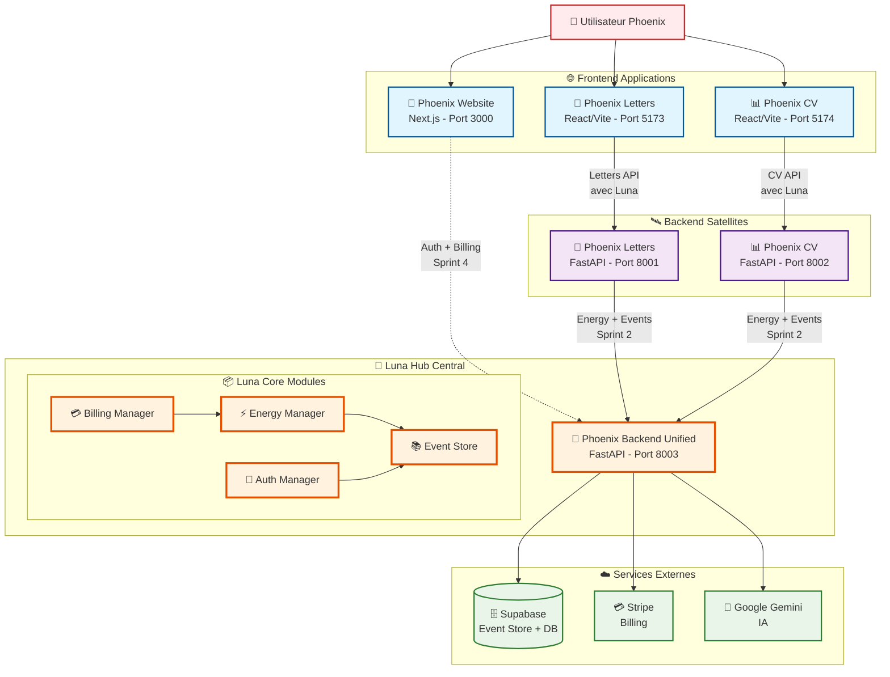
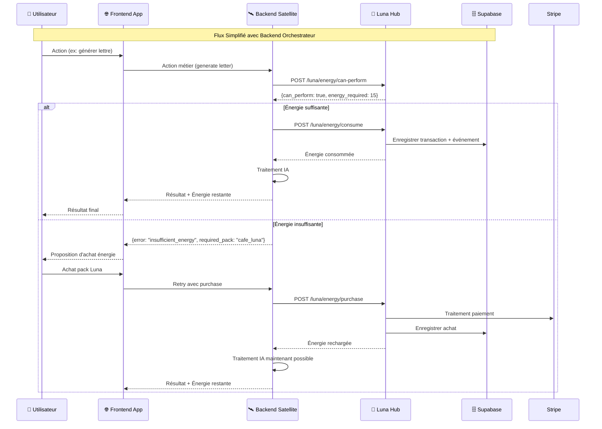

# 🏗️ Phoenix Ecosystem - Architecture Cible v1.0

## 🌙 Schéma d'Architecture Luna Hub Central



## 🚀 Flux de Données Luna



## 📋 Mapping des Ports

| Service | Port | Description | Sprint |
|---------|------|-------------|--------|
| 🌙 **Luna Hub** | **8003** | **Hub central** | **✅ Sprint 1** |
| 📝 Phoenix Letters | 8001 | Backend Letters | Existant |
| 📊 Phoenix CV | 8002 | Backend CV | Existant |
| 🌅 Phoenix Website | 3000 | Website Next.js | Sprint 4 |
| 📝 Letters Frontend | 5173 | React/Vite Letters | Existant |
| 📊 CV Frontend | 5174 | React/Vite CV | Existant |

## 🌙 API Luna Hub - Endpoints

### ⚡ Energy Management
```
POST /luna/energy/check           - Vérifier solde énergie
POST /luna/energy/can-perform     - Vérifier action possible  
POST /luna/energy/consume         - Consommer énergie
POST /luna/energy/refund          - Rembourser énergie
POST /luna/energy/purchase        - Acheter pack énergie
GET  /luna/energy/transactions/{user_id} - Historique
GET  /luna/energy/analytics/{user_id}    - Analytics
```

### 📚 Event Store (Sprint 2)
```
POST /luna/events                 - Créer événement
GET  /luna/events/{user_id}       - Récupérer événements bruts
GET  /luna/narrative/{user_id}    - Capital Narratif (Event Sourcing)
```

**🎯 Important**: `/luna/narrative/{user_id}` reconstruit TOUJOURS le Capital Narratif en temps réel depuis l'Event Store Supabase. Aucun état intermédiaire stocké - pure logique Event Sourcing.

### 🔐 Auth Central (Sprint 3)
```
POST /auth/login                  - Connexion
POST /auth/register               - Inscription  
GET  /auth/profile                - Profil utilisateur
```

### 💳 Billing (Sprint 4)
```
POST /billing/create-intent       - Créer intention paiement
POST /billing/confirm-payment     - Confirmer paiement
GET  /billing/history/{user_id}   - Historique achats
```

## 🔄 Grille de Consommation Énergie

| Action | Énergie | App Source |
|--------|---------|------------|
| **Actions Simples (5-10%)** |
| Conseil rapide | 5% | Letters/CV |
| Correction ponctuelle | 5% | Letters/CV |
| Format lettre | 8% | Letters |
| **Actions Moyennes (10-20%)** |
| Lettre motivation | 15% | Letters |
| Optimisation CV | 12% | CV |
| Analyse offre | 10% | Letters/CV |
| **Actions Complexes (20-40%)** |
| Analyse CV complète | 25% | CV |
| Mirror Match | 30% | CV |
| Stratégie candidature | 35% | Letters |
| **Actions Premium (35-50%)** |
| Audit complet profil | 45% | CV |
| Plan reconversion | 50% | Letters |
| Simulation entretien | 40% | CV |

## 💰 Packs Énergie Luna

| Pack | Prix | Énergie | Bonus | Comportement |
|------|------|---------|-------|-------------|
| ☕ Café Luna | 2,99€ | 100% | +10% premier achat | Décompte standard |
| 🥐 Petit-déj Luna | 5,99€ | 100% | - | Décompte standard |
| 🍕 Repas Luna | 9,99€ | 100% | - | Décompte standard |
| 🌙 Luna Unlimited | 29,99€/mois | ∞ | - | **Pas de décompte, mais événements toujours enregistrés** |

### 🎯 Règles Spéciales Luna Unlimited (Oracle)

1. **Énergie** : Aucun décompte d'énergie lors des actions
2. **Événements** : TOUJOURS enregistrer dans l'Event Store pour Capital Narratif
3. **Analytics** : Actions trackées pour API Iris même sans consommation
4. **can_perform** : Retourne toujours `true` pour toute action

## 🏗️ État par Sprint

### ✅ Sprint 0 (Actuel)
- [x] Structure phoenix-backend-unified
- [x] Modèles énergie Luna
- [x] Energy Manager + APIs
- [x] Schema Supabase préparé
- [x] Diagramme architecture

### ⏳ Sprint 1 (Suivant)  
- [ ] Tests unitaires Energy Manager
- [ ] Documentation API Swagger
- [ ] Validation endpoints

### 📋 Sprint 2
- [ ] Intégration Supabase Event Store
- [ ] Middleware sécurité
- [ ] Logs structurés JSON

### 📋 Sprint 3
- [ ] Connexion Letters/CV au Hub
- [ ] Tests d'intégration
- [ ] Health checks

### 📋 Sprint 4  
- [ ] Billing Stripe
- [ ] Frontend Website
- [ ] Cycle économique complet

### 📋 Sprint 5
- [ ] Déploiement Railway
- [ ] CI/CD GitHub Actions
- [ ] Beta users

---

**🔥 Architecture Luna Hub opérationnelle - Prête pour Sprint 1 !** 🌙